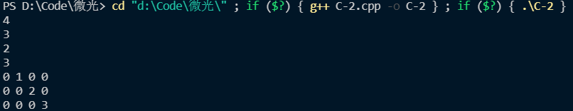

# 回答问题
> 结构体是什么，struct关键字和typedef关键字你是如何理解的?
  
  结构体就是一些数据的组合。在C中，struct不能有成员函数。C++中就和类差不多。。

  `typedef`大概就是给一个数据类型取个别名。
> 你是如何判断内存分配出现问题的？  

若`malloc`返回空指针，则出现问题。

> 扩展部分

不能运行，因为返回的是在栈内存里`array`的指针，而`array`在这个函数结束后被释放掉了。
# 代码部分
## 截图

## 源码
```C++
#include <bits/stdc++.h>
using namespace std;

typedef struct
{
    int *array;
    int row;
    int line;
} two_dimensional_array;

two_dimensional_array construct_two_dimensional_array(int row, int line);
void insert_into_array(two_dimensional_array *array, int value, int row, int line);
int read_from_array(two_dimensional_array *array, int row, int line);
void traverse_array(two_dimensional_array *array);
void destory_array(two_dimensional_array *array);
void malloc_error();
void out_of_index_error();

void construct_two_dimensional_array(two_dimensional_array *array, int row, int line)
{
    array->line = row;
    array->row = line;
    array->array = (int *)malloc(row * line * sizeof(int));
    if (array->array == NULL)
        malloc_error();
    memset(array->array, 0, row * line * sizeof(int)); //将malloc数组初始化为0
}

void insert_into_array(two_dimensional_array *array, int value, int row, int line)
{
    if (row > array->row || line > array->line || row < 0 || line < 0)
    {
        out_of_index_error();
        return;
    }
    array->array[row * array->row + line] = value;
    return;
}

int read_from_array(two_dimensional_array *array, int row, int line)
{
    if (row > array->row || line > array->line || row < 0 || line < 0)
    {
        out_of_index_error();
        return 114514;
    }
    else
        return array->array[row * array->row + line];
}

void traverse_array(two_dimensional_array *array)
{
    for (int i = 0; i < array->line * array->row; i++)
    {
        cout << array->array[i] << " ";
        if (!((i + 1) % array->row))
            cout << endl;
    }
}

void destory_array(two_dimensional_array *array)
{
    free(array->array);
    array->array = NULL;
}

void malloc_error()
{
    cout << "malloc_error" << endl;
    return;
}

void out_of_index_error()
{
    cout << "index_error" << endl;
}

int main()
{
    two_dimensional_array array;
    construct_two_dimensional_array(&array, 3, 4);
    printf("%d\n", array.row);
    printf("%d\n", array.line);
    insert_into_array(&array, 1, 0, 1);
    insert_into_array(&array, 2, 1, 2);
    insert_into_array(&array, 3, 2, 3);
    printf("%d\n", read_from_array(&array, 1, 2));
    printf("%d\n", read_from_array(&array, 2, 3));
    traverse_array(&array);
    destory_array(&array);
    return 0;
}

```