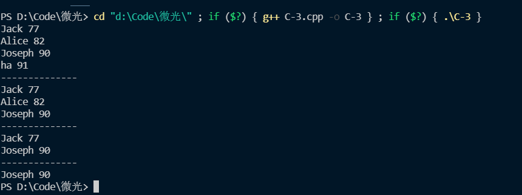
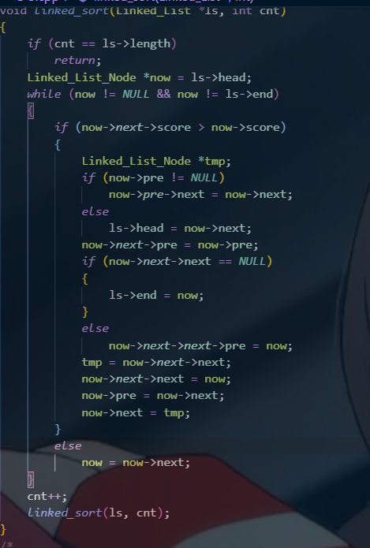
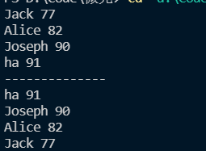
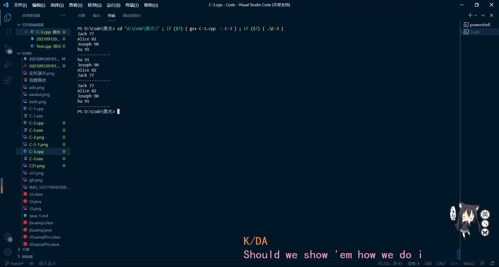

# 问题回答
> 用你的语言简单说说链表是什么  

链表是一种数据结构，它由结点构成，结点记录数据和相关其他结点的地址

> 链表和数组的不同  

链表在内存中地址可以是不连续的，在C中数组内存地址是连续的。  
链表可以实现插入，删除某结点等操作。

# 代码
## 基础截图
1. 删除ha（尾部结点）
2. 删除Alice(中间结点)
3. 删除Jack(head)

## 扩展部分
### 排序
采用冒泡排序$O(n^2)$写法  

排序函数如图
  

运行截图  

  
我认为一个有点ex的地方在于交换两个数，周围一共四个数都要受影响。  
冒泡都这么麻烦了，快排该咋写我都不敢想了。

### 反转了！！！
大致思路是遍历一遍链表，每个node从头插入一个新链表，最后返回新链表地址  

先排序，再反转结果如图


## 源码
```C
#include <bits/stdc++.h>
using namespace std;
#define NAME 12

typedef struct Node
{
    string name; //姓名
    int score;   //分数
    struct Node *next, *pre;
} Linked_List_Node;

typedef struct
{
    Linked_List_Node *head, *end;
    int length;
} Linked_List;

Linked_List_Node *linked_list_node_construct(char name[], int score);
Linked_List *linked_list_consctruct();
void add_node_to_head(Linked_List *linkedList, Linked_List_Node *node);
void add_node_to_bottom(Linked_List *linkedList, Linked_List_Node *node);
void delete_linked_list_node_by_name(Linked_List *linkedList, char name[]);
void print_linked_list_nodes(Linked_List *linkedList);

/*
**输入:姓名name与成绩score
**输出:构造完的链表节点的指针
**函数作用:通过姓名和成绩构造一个链表节点
*/
Linked_List_Node *linked_list_node_construct(string name, int score)
{
    Linked_List_Node *tmp = new Linked_List_Node;
    tmp->name = name;
    tmp->score = score;
    tmp->next = NULL;
    tmp->pre = NULL;
    return tmp;
}

/*
**输入:无
**输出:初始化头指针与长度的链表指针
**函数作用:返回一个已经初始化头指针与长度的链表指针
*/
Linked_List *linked_list_consctruct()
{
    Linked_List *tmp = new Linked_List;
    tmp->head = NULL;
    tmp->end = NULL;
    tmp->length = 0;
    return tmp;
}

/*
**输入:指向链表的指针linkedList和指向链表节点的指针node
**输出:无
**函数作用:通过头插法的方式将一个节点插入到链表之中
*/
void add_node_to_head(Linked_List *linkedList, Linked_List_Node *node)
{
    if (linkedList->head != NULL)
    {
        Linked_List_Node *tmp = linkedList->head;
        linkedList->head = node;
        node->next = tmp;
        tmp->pre = node;
    }
    else
    {
        linkedList->head = node;
        linkedList->end = node;
    }
    linkedList->length++;
    return;
}

/*
**输入:指向链表的指针linkedList和指向链表节点的指针node
**输出:无
**函数作用:通过尾差法的方式将一个节点插入到链表之中
*/
void add_node_to_bottom(Linked_List *linkedList, Linked_List_Node *node)
{
    if (linkedList->end == NULL)
    {
        linkedList->end = node;
        linkedList->head = node;
    }
    else
    {
        node->pre = linkedList->end;
        linkedList->end->next = node;
        linkedList->end = node;
    }
    linkedList->length++;
}

/*
**输入:指向链表的指针linkedList和姓名name
**输出:无
**函数作用:删除链表中队名与给定队名一致的节点
*/
void delete_linked_list_node_by_name(Linked_List *linkedList, string name)
{
    Linked_List_Node *now = linkedList->head;
    Linked_List_Node *pre = NULL;
    while (now != NULL)
    {
        if (now->name == name)
        {
            --linkedList->length;
            if (now == linkedList->head)
            {
                linkedList->head = now->next;
                now->next = NULL;
                return;
            }
            if (now == linkedList->end)
            {
                linkedList->end = pre;
                pre->next = NULL;
                return;
            }
            pre->next = now->next;
            now->next = NULL;
            return;
        }
        pre = now;
        now = now->next;
    }

    if (now == NULL)
    {
        cout << "Not Found" << endl;
        return;
    }
    return;
}

/*
**输入:指向链表的指针linkedList
**输出:无
**函数作用:遍历链表，打印每位支队伍的队名以及得分
*/
void print_linked_list_nodes(Linked_List *linkedList)
{
    Linked_List_Node *now = linkedList->head;
    while (now != NULL)
    {

        cout << now->name << " " << now->score << endl;
        // if(now!=linkedList->head) cout<<"pre is"<<now->pre->name<<" ";
        //   if(now!=linkedList->end) cout<<"next is"<<now->next->name<<" ";
        //cout<<endl;
        now = now->next;
    }
    cout << "--------------" << endl;
}
void linked_sort(Linked_List *ls, int cnt)
{
    if (cnt == ls->length)
        return;
    Linked_List_Node *now = ls->head;
    while (now != NULL && now != ls->end)
    {
        if (now->next->score > now->score)
        {
            Linked_List_Node *tmp;
            if (now->pre != NULL)
                now->pre->next = now->next;
            else
                ls->head = now->next;
            now->next->pre = now->pre;
            if (now->next->next == NULL)
            {
                ls->end = now;
            }
            else
                now->next->next->pre = now;
            tmp = now->next->next;
            now->next->next = now;
            now->pre = now->next;
            now->next = tmp;
        }
        else
            now = now->next;
    }
    cnt++;
    linked_sort(ls, cnt);
}
Linked_List *fanzhuan(Linked_List *ls)
{
    Linked_List *tmp = linked_list_consctruct();
    Linked_List_Node *now = ls->head;
    while (now != NULL)
    {
        //    cout << now->name << " "<<now->next->name<<endl;
        add_node_to_head(tmp, linked_list_node_construct(now->name, now->score));
        now = now->next;
    }
    return tmp;
}
/*
**调试你的程序，要求如下:
**构造一个空链表
**插入4个链表节点，分别是: (name:Jack score:77),(name:Alice score:82),(name:Joseph score:90),(name:ha score:91)
**遍历一遍链表，打印所有的节点信息
**删除姓名为ha所对应的节点
**重新遍历一遍链表，打印所有的节点信息
*/
int main()
{

    Linked_List *ls = linked_list_consctruct();
    string jack = "Jack", alice = "Alice", joe = "Joseph", haa = "ha";
    Linked_List_Node *Jack = linked_list_node_construct(jack, 77);
    Linked_List_Node *Alice = linked_list_node_construct(alice, 82);
    Linked_List_Node *Joseph = linked_list_node_construct(joe, 90);
    Linked_List_Node *ha = linked_list_node_construct(haa, 91);
    add_node_to_bottom(ls, Jack);
    add_node_to_bottom(ls, Alice);
    add_node_to_bottom(ls, Joseph);
    add_node_to_bottom(ls, ha);
    print_linked_list_nodes(ls);
    linked_sort(ls, 0);
    print_linked_list_nodes(ls);
    ls = fanzhuan(ls);
    // delete_linked_list_node_by_name(ls, haa);
    print_linked_list_nodes(ls);
    // cout << "--------------" << endl;
    // delete_linked_list_node_by_name(ls, alice);
    // print_linked_list_nodes(ls);
    // cout << "--------------" << endl;
    // delete_linked_list_node_by_name(ls, jack);
    // print_linked_list_nodes(ls);
    return 0;
}
```