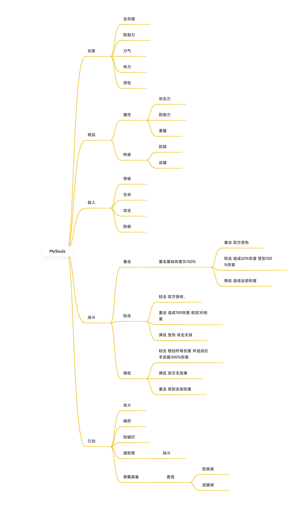
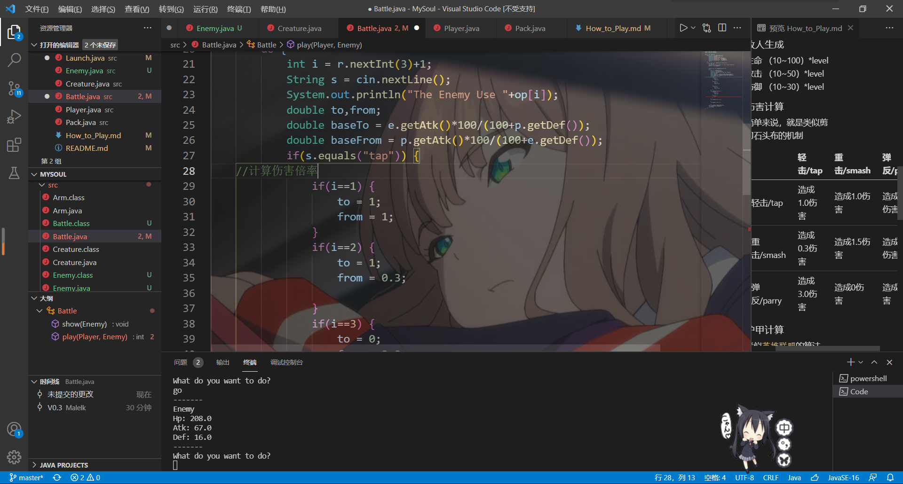
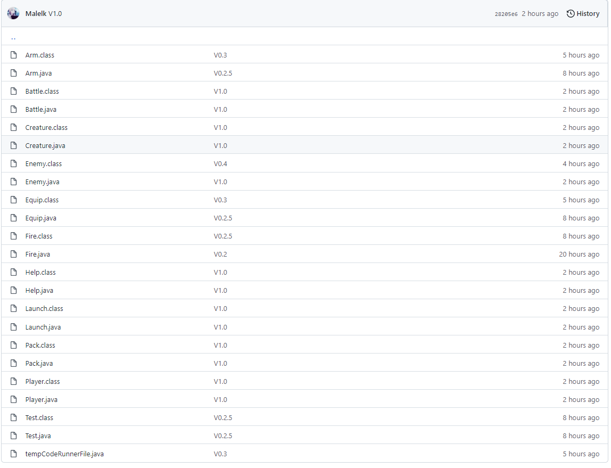
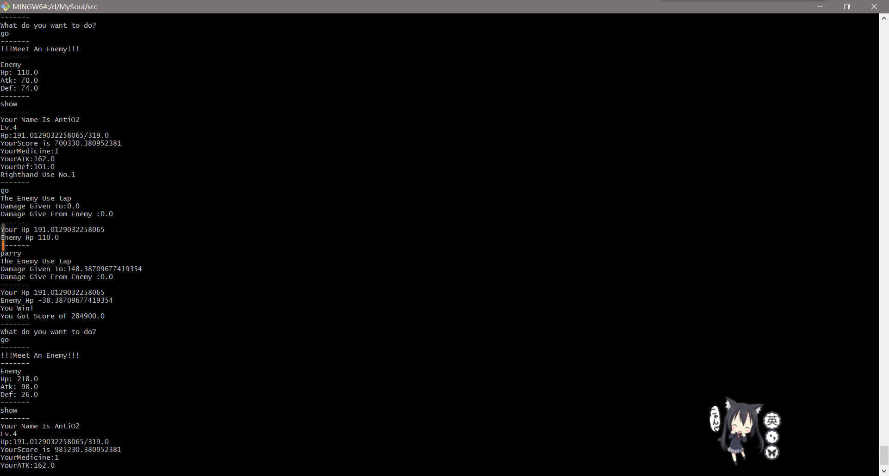

# Java第二题
没咋耍过MC，最近在黑魂受苦。尝试写一下这种。^ ^
## [我的github链接](https://github.com/Malelk/MySoul)
把游戏说明和源代码都放里面了。  

## 下载
`git clone https://github.com/Malelk/MySoul.git`  
## 打开方式
请使用`Launch`打开，游玩前先查看帮助文档，或在游戏内使用`help`获取帮助。

## 回答要求 （萌新不完全理解）
1. 类是什么？我觉得中文翻译得挺好，类就是字面意义上的类。比如人类，就是所有人的统称。在这下面人就是类的对象。对象是具体的。类可以是抽象类
2. - 封装就是保护类里面的对象或者属性。比如我嗯一下电脑上的开机键，我没必要知道主板上发生了啥，只是用这个键开机。电源键就是电脑这个对象的接口。
    - 继承是对类而言，子类可以继承父类的属性与方法。~~这样就减少了ctrl+c,v的麻烦~~ 使代码复用率提高，后期修改也便于维护。想要修改子类的共同属性，修改父类再继承就行了。
    - 多态指子类可以有与父类或者其他子类不同的属性，方法。可以对父类进行重载。

3. 我遇到的困难
    - 初学java，对一些性质还不太了解。
    - 写的我腰很痛
    - github我现在得挂梯子才连得上去
    - 对项目结构的设计
    - 一开始游戏难度调高了，我自己打不过没过= =
4. 我学到的一些知识点
   - 如果不new 一个对象，想直接对它的属性或方法进行调用时，得用static修饰。
   - 一般类都提供`get,set`当接口，把属性用`private`保护。
   - jar没法打包成纯exe。我想给其他人玩玩都不行= =
## 做的过程
1. 大概构思

2. 开始肝代码

3. 更新版本与push

4. 实机测试，然后发现一堆bug

## 一个小请求
能不能开两把我这个做的并不完善的小游戏呢 ^ ^
