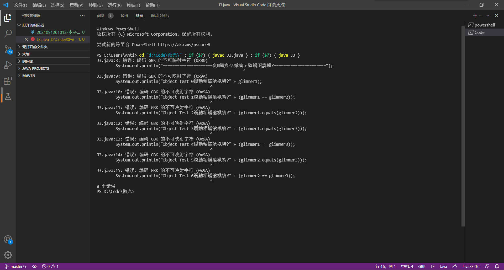
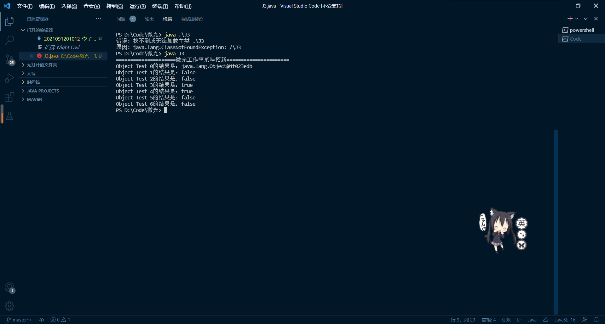
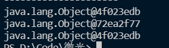
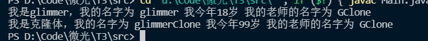
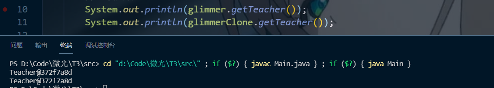
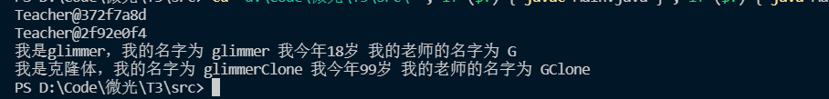
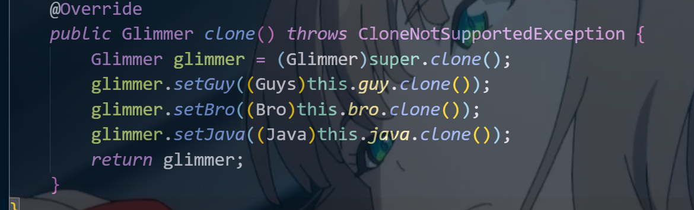
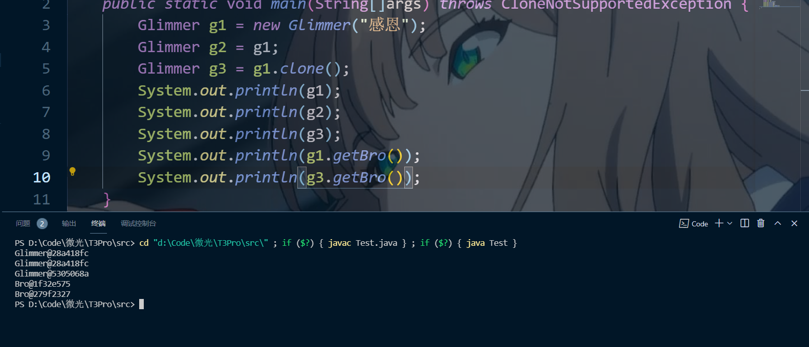

# Java-03
说实话一开始直接把代码贴进来我是拒绝的

## T1
尝试解读问题
    

0. 输出的是`glimmer1`的地址
1. 两个地址不同。
2. `Object`中，`equal`默认比较俩东西的地址。`g1`和`g2`都是`new`出来的, 会放在堆内存里。在堆内存拥有不同地址。
3. `g3`不是`new`出来的，而是引用的`g1`。事实上`g3`指向`g1`.（坏了，我成替身了）*看图*
4. `equals`比较了`g1,g3`的指向地址相同。但是好像`g3`本身应该是放在栈里面的。。。
5. `g3,g2`地址不同
6. `g3,g2`地址不同
## T2
百度搜了一哈，发现java地址被封装了。有点震惊。
### PART1

虽然不太了解原理，但是看起来`clone`这个方法应该是复制了变量，引用变量也复制过来了，可以进行单独修改。但是---当使用`getTeacher().setName()`时，修改的是`Teacher这个对象本身的，在堆内存里的属性`，clone 过来，student里面的teacher，虽然是两个不同的引用变量，但是引用的是同一个老师。所以两个老师名字都更改了。  
然后不妨稍微修改下代码，发现俩老师确实一样

### PART2
执行代码

发现teacher地址不一样了，说明这哈teacher不是被引用，而是复制了一个新的出来捏。
### Part3
这套娃是否有点。。。这道题弄清楚包含关系从小往大复制粘贴就好了

测试一下

g3和g1啥都不一样了捏。
我将代码push到了  

