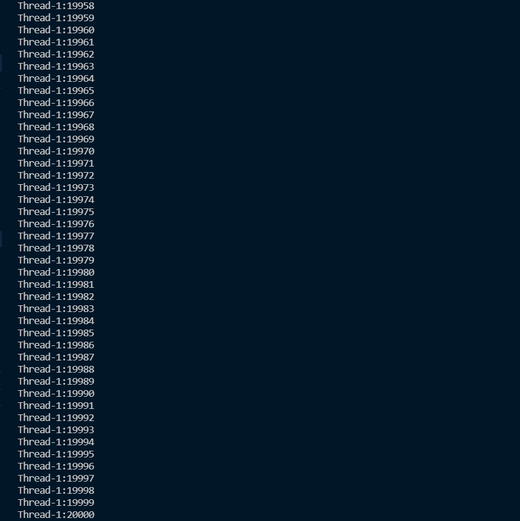
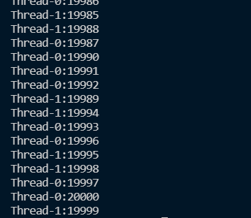
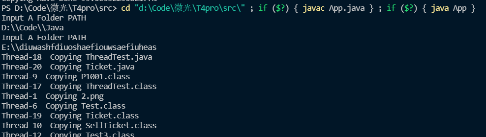

# Task 1
> Java中实现多线程的方法有哪些？

- 继承Thread类，重写run方法。  
- 实现runnable接口，再`Thread xiancheng = new Thread(实现接口的类)`  
  
> 举例说明身边用到了多线程的3个例子（来自廖老的question）  

(身边的多线程？不一定指计算机方面吧 = =)

1.  下资源时使用多线程下载

2. 高中做作业的时候一些人做选择题，一些人做填空题，最后合起来提高了效率
3. 点开一个软件，一般是由很多线程一起运行的。
    

> 线程池的优势有哪些？

增加了cpu的利用效率，减少了线程的响应时间。

## Task 2
```java
public class App {
    public static void main(String[] args) throws Exception {
        Count ct = new Count();
        Thread t1 = new Thread(ct);
        Thread t2 = new Thread(ct);
        t1.start();
        t2.start();       
    }
}
```
1. （因为输出原因，把1000000改成10000了） 试了很多次还没出错，我人麻了。而且看了下给出的代码应该没啥出错机会。。。题目中给出的实现类是各数10000次，而不是加起来数20000次。~~我觉得题面给错了~~
  

2. 我觉得你们是想问这种（大概）  
```java
    public void run() {
        for (; num <= 20000; num++) {

            System.out.println(Thread.currentThread().getName() + ":" + num);
        }

    }
```  

这种就顺利数错了，爽到。
  

原因就是第一个线程已经进入了循环，准备好`num++`了，这个时候被第二个线程抢了cpu执行权，就开始等。等完了它才能`num++`  

3. 用`thread_1.setPriority(10)`修改优先级，优先级在$1 - 10$之间. 优先级只是增加概率，并不能严格按照优先级执行  

## Task 3  

### 思路
  

不难看出这个任务对Java的File类和IO流要点理解。  

### 实现
1. 可以通过字节输入输出流来复制文件
2. 遍历并嵌套函数，实现多级文件夹复制。

### 脑测一下困难  
1. IO流与File类的运用
2. 多线程同步有点难写,如何给不同线程分配文件？。
3. 一堆bug

### 实现
- 通过字节流copy
- 通过字节大小来计算进度
- 遇到文件，加一个copy进程到池中，遇到文件夹递归
- 本来还想写个计时器的，但是没精力调了
### 具体代码
放在github上了，因为代码不够健壮，所以测试前请一定阅读README  
  
### 一些bug
- 字节计数器加不到100，大概是因为`int`类型转化的原因？
- 我发现在调用`work`方法后，无法输出东西，没找到原因。
- 没给cnt加同步，所以进度出现得并不均匀。甚至还有字节显示往后跳的情况。但是我怕加了锁多进程降低效率。。。所以没改了。