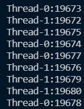
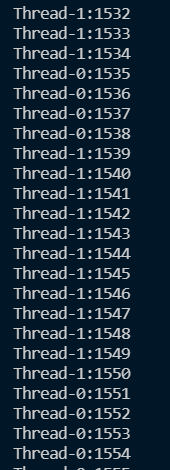

## Task 1
> Java中实现多线程的方法有哪些？

- 继承Thread类，重写run方法。  
- 实现runnable接口，再`Thread xiancheng = new Thread(实现接口的类)`  
  
> 举例说明身边用到了多线程的3个例子（来自廖老的question）  

(身边的多线程？不一定指计算机方面吧 = =)

1.  下资源时使用多线程下载

2. 高中做作业的时候一些人做选择题，一些人做填空题，最后合起来提高了效率
3. 点开一个软件，一般是由很多线程一起运行的。
    

> 线程池的优势有哪些？

增加了cpu的利用效率，减少了线程的响应时间。

## Task 2
```java
public class App {
    public static void main(String[] args) throws Exception {
        Count ct = new Count();
        Thread t1 = new Thread(ct);
        Thread t2 = new Thread(ct);
        t1.start();
        t2.start();       
    }
}
```
运行截图
  
可以看到在中间明显乱了
### 发生问题的原因
```java
        for(int i = 0; i < 1000; i++){
            num++;
            System.out.println(Thread.currentThread().getName() + ":" + num);
          }
```
假如thread_1在执行完成num++后，thread_2获得cpu执行权，thread_1被阻塞，延迟进行输出语句。
### 解决方法：
**加同步锁**锁死操作共享数据的代码块  

循环里面改成下面的代码
```java
synchronized(obj) {
            num++;
            System.out.println(Thread.currentThread().getName() + ":" + num);
          }
```  
再次进行运行，就按照顺序数数了
  
也可以进行**方法同步**  
```java
  public void run() {

    for (int i = 0; i < 1000; i++) {
      cnt();
    }
  }
  private synchronized  void cnt() {
        num++;
        System.out.println(Thread.currentThread().getName() + ":" + num);
  }
```
1. 用`thread_1.setPriority(10)`修改优先级，优先级在$1 - 10$之间. 优先级只是增加概率，并不能严格按照优先级执行  

## Task 3  

### 思路
  

不难看出这个任务对Java的File类和IO流要点理解。  

### 实现
1. 可以通过字节输入输出流来复制文件
2. 遍历并嵌套函数，实现多级文件夹复制。

### 脑测一下困难  
1. IO流与File类的运用
2. 多线程同步有点难写,如何给不同线程分配文件？。
3. 一堆bug

### 实现
- 通过字节流copy
- 通过字节大小来计算进度
- 遇到文件，加一个copy进程到池中，遇到文件夹递归
- 本来还想写个计时器的，但是没精力调了

  
### 具体代码
放在github上了，因为代码不够健壮，所以测试前请一定阅读README  
[github链接](https://github.com/Malelk/FolderCopyTool)  
使用`clone https://github.com/Malelk/FolderCopyTool.git`下载


### 一些bug
- 字节计数器加不到100，大概是因为`int`类型转化的原因？
- 我发现在调用`work`方法后，无法输出东西，没找到原因。
- 没给cnt加同步，所以进度出现得并不均匀。甚至还有字节显示往后跳的情况。但是我怕加了锁多进程降低效率。。。所以没改了。