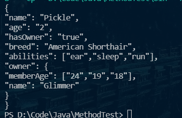

## 第一次Maven使用 
### 使用准备
下载并配置好maven   
首先进行一个文件的下载
  
进行一个对pom.xml的观察  
  
然后修改本地仓库位置，将镜像更换为阿里云(其实没感觉到快多少)。

-----------学了一周maven后放弃治疗了-----------  
然后尝试将下载的jar包导入本地仓库
  
    结果不知道为什么路径设置好了还一直出错，选择开做t2  
## Task2  
这道题前置知识有点多啊 = = ，而且网上还有点难找想要的资料。  
又花了几天学了一点反射    
但是不知道怎么判断一个属性的类型，于是决定用了一个~~有点低级~~的方法，获得类型的名称再比较字符串.
  
1.先把基本的数据类型试出来。
2.再把数组试出来 可以发现数组的名称是由`[`开头的，比如整形数组`[I`。要注意，数组可以存储数组（二维数组）或者对象。
3.再把对象试出来 对象有点复杂，比如我在`icu.lzn.Cat`得到的名称是`icu.lzn.Cat`，不好判断，于是我默认不是基本数据或者数组的都算作类（好像有点问题）
### 部分代码
- 大力出奇迹进行一个类型的判断
  
```java
    private boolean isBase(Field f) { // 判断可以直接输出的
        boolean ans = false;
        String s = f.getType().toString();
        if (s.equals("int") || s.equals("java.lang.String") || s.equals("double") || s.equals("short")
                || s.equals("java.lang.Byte") || s.equals("float") || s.equals("boolean") || s.equals("char")
                || s.equals("long"))
            ans = true;
        return ans;
    }
```
- 发现直接`field.get(Object)`好像会出问题，决定使用invoke。先得匹配对应的`getter`
> ps.Boolean的getter格式是isXXX(),所以我进行了两次判断  分别判断和getXXX或isXxx匹配
- 获得对应get方法的代码

```java
    private static Method gMethod(Field f, Object obj) {
        Method tmp = null;
        Method[] ms = obj.getClass().getDeclaredMethods(); // 获取方法
        for (Method m : ms) {
         //   System.out.println(m);
            if (m.getName().toLowerCase().equals(("get" + f.getName()).toLowerCase()))// 通过字符串匹配，得到对应的get
                tmp = m;
            if (m.getName().toLowerCase().equals(("is" + f.getName()).toLowerCase()))// 通过字符串匹配，得到对应的get
                tmp = m;
        }
        return tmp;
    }
```

### 实例代码
> 说在前面的一些话
>> 1.这个toJson的方法还有很多都暂时没实现，比如数组是二维数组，对象数组，这份代码应该是不能转换的。数组暂时只写了`int[] `和`String[]`,但是`int[]`其他基本类型的数组是一个道理，所以就不再增加代码长度了  
>> 2. 如果属性指向了`null`是会报错的，所以在测试时要保证不是空指针。  
>> 3. 如果一个类里面没有属性，或者数组长度为0，也没有进行特别判断。  
>> 4. 数组或对象的get方法不应该直接`return int[]`否则会导致两个引用变量的值相同，导致不安全。应当像我 `Cat.getAbilities()`那样，新建一个数组，再返回。其他地方同理，但是我没修改= = 
- 首先是toJson
```java
import java.lang.reflect.Field;
import java.lang.reflect.InvocationTargetException;
import java.lang.reflect.Method;

public class Json {
    public static Object obj;

    public static void toJson(Object obj)
            throws IllegalArgumentException, IllegalAccessException, InvocationTargetException {
        StringBuffer json = new StringBuffer();
        Work(obj, json);
        System.out.println(json);
    }

    // 主要的工作函数，可以进行递归操作
    private static void Work(Object obj, StringBuffer s)
            throws IllegalArgumentException, IllegalAccessException, InvocationTargetException {

        s.append("{\n");
        // 获取所有属性
        Field[] fs = obj.getClass().getDeclaredFields();
        for (Field f : fs) {
            /**
             * 如果是基础类型的情况
             */
            if (isBase(f)) {
                jsonBase(f, s, obj);
                continue;

            }
            /**
             * 如果是数组的情况
             */
            if (isArr(f)) {

                Method tmp = gMethod(f, obj);
                s.append("\"" + f.getName() + "\": [");
                if (tmp.invoke(obj).getClass() == int[].class) {
                    int[] is = (int[]) tmp.invoke(obj);
                    for (int i = 0; i < is.length; i++) {
                        s.append("\"" + is[i] + "\"" + ",");
                    }
                    s.deleteCharAt(s.length() - 1);
                    s.append("],\n");
                    continue;
                }
                Object[] as = (Object[]) tmp.invoke(obj);

                if (as.length == 0) {
                    s.append("],\n");
                    continue;
                }
                for (Object ob : as) {
                    s.append("\"" + ob + "\"" + ",");
                }
                s.deleteCharAt(s.length() - 1);
                s.append("],\n");
                continue;
            }
            /**
             * 若属性为对象，进行递归
             */
            s.append("\"" + f.getName() + "\": ");
            Method tmp = gMethod(f, obj);
            Work(tmp.invoke(obj), s);
            s.append(",\n");
        }
        s.deleteCharAt(s.length() - 2);
        s.append("}");
        return;
    }

    /**
     * 判断是否为基础类型
     */
    private static boolean isBase(Field f) {
        boolean ans = false;
        String s = f.getType().getName();
        if (s.equals("int") || s.equals("java.lang.String") || s.equals("double") || s.equals("short")
                || s.equals("java.lang.Byte") || s.equals("float") || s.equals("boolean") || s.equals("char")
                || s.equals("long"))
            ans = true;
        return ans;
    }

    // 判断是否是数组
    private static boolean isArr(Field f) {
        boolean ans = false;
        String s = f.getType().getName();
        if (s.startsWith("["))
            ans = true;
        return ans;
    }

    /**
     * 生成基本类型的json
     * 
     * @throws IllegalAccessException
     * @throws IllegalArgumentException
     * @throws InvocationTargetException
     * 
     */
    private static void jsonBase(Field f, StringBuffer s, Object obj)
            throws IllegalArgumentException, IllegalAccessException, InvocationTargetException {
        s.append("\"" + f.getName() + "\": "); // 获得变量名

        Method tmp = gMethod(f, obj);
        s.append("\"" + tmp.invoke(obj) + "\",\n");
    }

    // 获取一个属性对应的getXxx
    private static Method gMethod(Field f, Object obj) {
        Method tmp = null;
        Method[] ms = obj.getClass().getDeclaredMethods(); // 获取方法
        for (Method m : ms) {
            // System.out.println(m);
            if (m.getName().toLowerCase().equals(("get" + f.getName()).toLowerCase()))// 通过字符串匹配，得到对应的get
                tmp = m;
            if (m.getName().toLowerCase().equals(("is" + f.getName()).toLowerCase()))// 通过字符串匹配，得到对应的get
                tmp = m;
        }
        return tmp;
    }
}
```  
- Cat类(放在了包`lizinuo.icu`下)
```java
package lizinuo.icu;

public class Cat {
    private String name;
    private int age;
    private boolean hasOwner;
    private String breed;
    private String[] abilities =null;
    private Owner owner;
    Cat() {
    };
    
    public Cat(String name, int age, boolean hasOwner, String breed, String[] abilities,Owner owner) {
        this.name = name;
        this.age = age;
        this.hasOwner = hasOwner;
        this.breed = breed;
        this.abilities = abilities;
        this.owner = owner;
    }
    public Owner getOwner() {
        return owner;
    }
    public String[] getAbilities() {
        return abilities;
    }
    public int getAge() {
        return age;
    }
    public String getBreed() {
        return breed;
    }
    public String getName() {
        return name;
    }
    public boolean isHasOwner() {
        return hasOwner;
    }
}

```

- 然后是 `Owner`类

```java
package lizinuo.icu;

public class Owner {
    int[] memberAge;
    String name;

    public Owner(String name, int[] i) {
        this.name = name;
        this.memberAge = i;
    }

    public int[] getMemberAge() {
        return memberAge;
    }

    public String getName() {
        return name;
    }
}

```

- 最后是测试代码

```java
import lizinuo.icu.Cat;
import lizinuo.icu.Owner;

public class App {
    public static void main(String[] args) throws Exception {
        Cat myCat = new Cat("Pickle", 2, true, "American Shorthair", new String[] { "ear", "sleep", "run" },
                new Owner("Glimmer", new int[] { 24, 19, 18 }));
        Json.toJson(myCat);
    }
}

```

- 进行检查

输出了  
  
再随便在网上找个json格式转化网站试一下 ,发现能够成功转化，说明格式对了 
  

### Task3  
还没学注解，我先交了^ ^