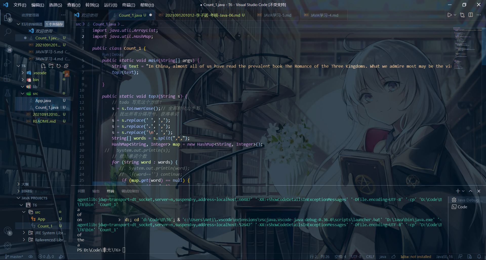

## Java_06
### 第一种写法
先通过`hashmap`统计每个单词出现个数，再遍历获得一个有单词信息的集合。  
在程序中注意到如果处理后的字符串带有`,,`,则`s.spilt(',')` 空字符串会被统计进去,使用正则表达式`,*,`后解决。  
代码如下  
```java
import java.util.ArrayList;
import java.util.HashMap;
import java.util.List;

public class Count_1 {
    public static void main(String[] args) {
        String text = "In a village of La Mancha, the name of which I have no desire to call to\n"
        + "mind, there lived not long since one of those gentlemen that keep a lance\n"
        + "in the lance-rack, an old buckler, a lean hack, and a greyhound for\n"
        + "coursing. An olla of rather more beef than mutton, a salad on most\n"
        + "nights, scraps on Saturdays, lentils on Fridays, and a pigeon or so extra\n"
        + "on Sundays, made away with three-quarters of his income.";
        top3(text);

    }

    public static void top3(String s) {
        // todo 写完这个方法！
        s = s.toLowerCase();// 全部转化为小写
        // 找出所有分隔符号，获得单词
        s = s.replace(' ', ',');
        s = s.replace('.', ',');
        s = s.replace('\n', ',');
        String[] words = s.split(",*,");
        HashMap<String, Integer> map = new HashMap<String, Integer>();
     //   System.out.println(s);
        // 统计单词个数
        for (String word : words) {
           //  System.out.println(word);
           //  if(word=='') continue;
            if (map.get(word) == null) {
                map.put(word, 1);
            } else
                map.put(word, map.get(word) + 1);

           // System.out.println(map);
        }
        ArrayList<Word> list = new ArrayList<Word>();
        for(String word : words) {
            if(map.get(word)!=-1) {
               list.add(new Word(word,map.get(word))); 
               map.put(word, -1);//打上标记，表示已经取出来了。
            }
        }

        //开始排序
        for(int i = 0;i< list.size();i++) {
            for(int j = 0;j<list.size()-1;j++) {
                if(list.get(j).getCnt()<list.get(j+1).getCnt()) {
                    Word tmp = new Word(list.get(j).getName(), list.get(j).getCnt());
                    list.set(j, list.get(j+1));
                    list.set(j+1, tmp);
                }
            }
        }
        
        //输出top3
        if(list.size()<3) {
            System.out.println("No Enough Words!");
            return;
        }
    
        for(int i = 0;i<3;i++) {
            System.out.println(list.get(i).getName());
        }
        return ;
    }

}

class Word {
    private int cnt;
    private String name;
    Word(String name,int cnt) {
        this.name = name;
        this.cnt = cnt;
    }
    public int getCnt() {
        return cnt;
    }
    public String getName() {
        return name;
    }
    public void setCnt(int cnt) {
        this.cnt = cnt;
    }
    public void setName(String name) {
        this.name = name;
    }
}
```  
然后尝试了一下今天下午写的英语作文
  
### 第二种写法  
在第一种写法中，对String数组进行处理，再排序取前三个。  
然后在网上查询到，可以使用`groupingBy`进行分组  
将第一种方法进行简化,写出下面代码  
```java
 Map<String, Long> map= list.stream()
            .collect(Collectors.groupingBy(x -> x, Collectors.counting()));
map.entrySet().stream().sorted((o1,o2)->{return (int) (o2.getValue()-o1.getValue());}).forEach  (o->{System.out.println(o.getKey());});
```
第一条语句获得map,第二条排序。但是很明显这是两句话，不太符合要求= = 。  
将这两句的map链接起来可以得到一长句
```java
        list.stream().collect(Collectors.groupingBy(x->x,Collectors.counting())).entrySet().stream().sorted((o1,o2)->{if(o2.getValue() > o1.getValue()) return 1;else return -1;}).limit(3).forEach( o ->{System.out.println(o.getKey()+" "+o.getValue());});        
```
完整代码如下
```java
package demo;
import java.util.Arrays;
import java.util.List;
import java.util.stream.Collectors;

public class Count_2 {
    public static void main(String[] args) {
        String text = "Whatever is worth doing is worth doing well.";
        top3(text);
    }

    public static void top3(String s) {
        // todo 写完这个方法！
        s = s.toLowerCase();// 全部转化为小写
        // 找出所有分隔符号，获得单词
        s = s.replace(' ', ',');
        s = s.replace('.', ',');
        s = s.replace('\n', ',');
        String[] words = s.split(",*,");
        List<String> list = Arrays.asList(words);
        list.stream().collect(Collectors.groupingBy(x->x,Collectors.counting())).entrySet().stream().sorted((o1,o2)->{if(o2.getValue() > o1.getValue()) return 1;else return -1;}).limit(3).forEach( o ->{System.out.println(o.getKey()+" "+o.getValue());});        
    }
}
```  
### 回答要求
> 对于任务一和任务二，写下你的编程思路，并把运行结果和代码提交  

**如上** 
> 大概讲讲Stream流处理的思路？他是怎么减少循环操作的呢？

大概是通过延迟操作，最后通过某种神秘生成的方式来对流进行处理。在一个元素被访问到之前，元素并不会被进行计算。  

> 在写Stream Api的时候，会遇到"->"或者"::"这样的写法，这就是lamda表达式，简单谈谈你对lamda表达式和函数式编程的理解吧  

我认为lambda表达式就是对匿名函数的~~懒人~~简洁写法  
比如上面的`.sorted((o1,o2)->{if(o2.getValue() > o1.getValue()) return 1;else return -1;})`   
可以写为  
```java
sorted(new Comparator<>(){
            @Override
            public int compare(Entry<String, Long> o1,Entry<String, Long> o2) {
                return (int) (((Entry<String, Long>) o2).getValue()-((Entry<String, Long>) o1).getValue());
            }
            
})
```  
sorted里面需要重写一个`Comparator`的接口,当这种接口有且只有一个抽象方法，就可以用lambda表达式。  
函数式编程和面向对象不同的地方在于，面向对象是对对象的属性，通过对象的方法进行操作，对于类进行封装。函数式编程对于函数进行封装，一个流就是一个函数  
（其实我不是很理解，类里面的方法不算函数吗。。。而且函数式编程到了最后是不是还是会被编译为命令式编程）  
> 在任务二的task前，我谈到了，有的计算流程，像排序，是需要依赖其他元素的，这种操作被称为“有状态操作”，像有些简单的过滤操作等，则被称为“无状态操作”，结合Tips里的文章，简单谈谈你的理解  

Stream中间过程被分为了有状态和无状态。无状态是对所有元素进行处理，有状态需要调用内部状态。需要保存数据。  
然后我在一篇文章中看到了下图  
  
  
可以看到`StreamAPI`内部对`sink`进行了叠加(用箭头连在一起),`Stream`的本质就是重写`Sink`里面的`begin(),accept(),end()`这些，然后通过一定方式进行链接的链表。这个链表可能是双向的，比如`accept`里面可以回调处理上一个函数。  
**例如**`sorted`的`accept`需要所有元素，他就不停的回调，直到获得所有元素。最后`end`判断获得所有元素后，将数据传递给下一个`sink`  
可以从上面看到，一些管道操作(比如`limit,skip`)需要数据，而另一些不需要(比如`fliter`)。无状态因为没有公用数据，适合并行`.parallel()`,而有状态依赖公用数据，并行会导致线程不安全。  
> 在完成该任务的时候，遇到的不熟悉的 Java 知识，建议做下笔记记录下来并提交

### [我的学习笔记](https://www.cnblogs.com/lizinuo/p/15375333.html)

## 改进  
可以通过`Stream.of(数组)`直接生成流。
```java
 Stream.of(s.replace(' ', ',').replace('.', ',').replace('\n', ',').split(",*,")).collect(Collectors.groupingBy(x->x,Collectors.counting())).entrySet().stream().sorted((o1,o2)->{if(o2.getValue() >
o1.getValue()) return 1;else return -1;}).limit(3).forEach( o ->
{System.out.println(o.getKey()+" "+o.getValue());});
```